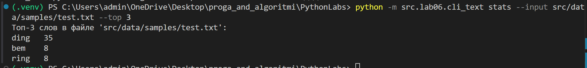
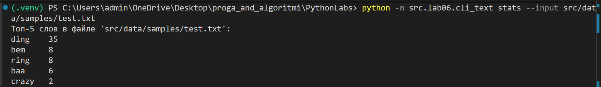
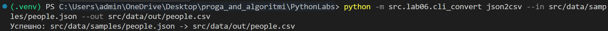
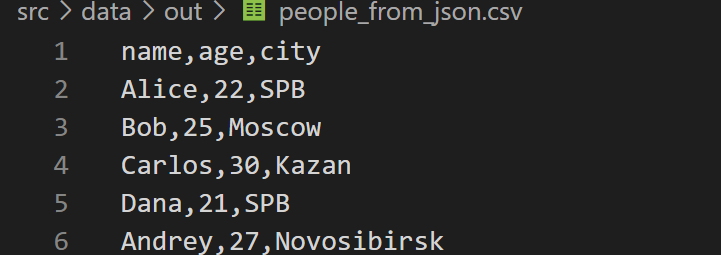
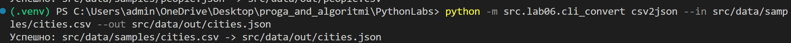
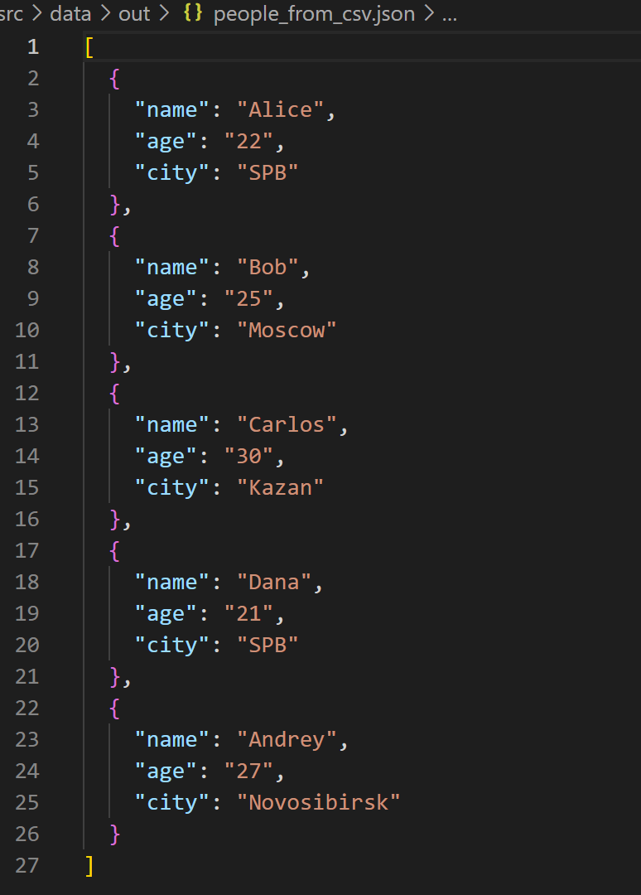
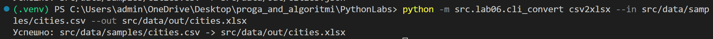
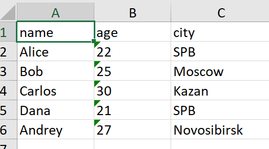
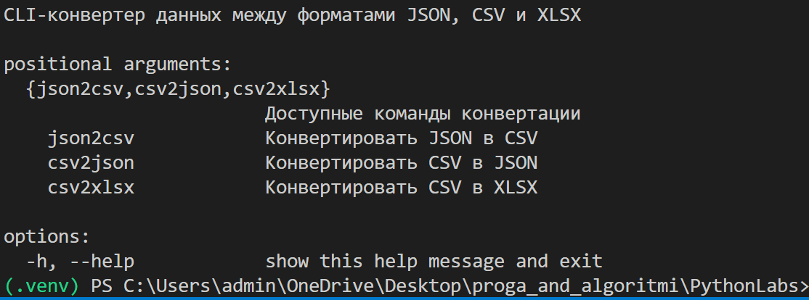

# Лабораторная работа 6: CLI‑утилиты с argparse

## Реализованные CLI‑утилиты

- Модуль `src/lab06/cli_text.py` с подкомандами:
  - `stats --input <txt> [--top 5]` — анализ частот слов в тексте;
  - `cat --input <path> [-n]` — вывод содержимого файла построчно (с нумерацией при `-n`).

- Модуль `src/lab06/cli_convert.py` с подкомандами:
  - `json2csv --in data/samples/people.json --out data/out/people.csv`  
  - `csv2json --in data/samples/people.csv --out data/out/people.json`  
  - `csv2xlsx --in data/samples/people.csv --out data/out/people.xlsx`

  ## Результаты выполнения

### cli_text

### код:
```python
import argparse
from pathlib import Path
import sys
import os

# Добавляю путь к src, чтобы можно было использовать lib/text.py
sys.path.append(os.path.join(os.path.dirname(__file__), ".."))

from lib.text import normalize, tokenize, count_freq, top_n


def read_text_file(path: Path) -> str:
    return path.read_text(encoding="utf-8")


def command_cat(input_path: str, number_lines: bool) -> None:
    path = Path(input_path)

    if not path.is_file():
        print(f"Ошибка: файл '{path}' не найден.", file=sys.stderr)
        raise FileNotFoundError(path)

    with path.open(encoding="utf-8") as f:
        if number_lines:
            for idx, line in enumerate(f, start=1):
                print(f"{idx}\t{line.rstrip()}")
        else:
            for line in f:
                print(line.rstrip())


def command_stats(input_path: str, top_count: int) -> None:
    path = Path(input_path)

    if not path.is_file():
        print(f"Ошибка: файл '{path}' не найден.", file=sys.stderr)
        raise FileNotFoundError(path)

    text = read_text_file(path)
    if not text.strip():
        print("Файл пуст — статистику не посчитать.", file=sys.stderr)
        return

    normalized = normalize(text, casefold=True, yo2e=True)
    tokens = tokenize(normalized)
    freq = count_freq(tokens)
    top_words = top_n(freq, top_count)

    print(f"Топ-{top_count} слов в файле '{input_path}':")

    max_len = max(len(word) for word, _ in top_words)
    for word, count in top_words:
        print(f"{word.ljust(max_len)}   {count}")


def build_parser() -> argparse.ArgumentParser:
    parser = argparse.ArgumentParser(
        description="CLI для работы с текстом (cat и stats)"
    )
    subparsers = parser.add_subparsers(
        dest="command",
        title="Команды",
        description="Доступные подкоманды: cat и stats",
    )

    # cat
    cat_parser = subparsers.add_parser(
        "cat",
        help="- Показать содержимое файла. В конце команды можно указать -n для нумерации строк",
    )
    cat_parser.add_argument("--input", required=True, help="Путь к файлу")
    cat_parser.add_argument(
        "-n",
        dest="number",
        action="store_true",
        help="Нумерация строк",
    )

    # stats
    stats_parser = subparsers.add_parser(
        "stats",
        help="- Статистика слов. В конце команды можно указать --top N для вывода топ-N слов (по умолчанию 5)",
    )
    stats_parser.add_argument("--input", required=True, help="Путь к файлу")
    stats_parser.add_argument(
        "--top",
        type=int,
        default=5,
        help="Сколько слов выводить",
    )

    return parser


def main(argv=None) -> None:
    # argv == None -> берем реальные аргументы командной строки
    if argv is None:
        argv = sys.argv[1:]

    # 1) Если вообще нет аргументов — короткая подсказка
    if not argv:
        print("CLI для работы с текстом (cat и stats)\n")
        print("Команды:")
        print("  cat   - Показать содержимое файла")
        print("  stats - Статистика слов\n")
        print("Использование:")
        print(
            "  python3 src/lab_06/cli_text.py (cat/stats) --input data/samples/файл\n"
        )
        return

    # 2) Если спрашивают общий help (--help или -h) — полная инструкция
    if argv[0] in ("-h", "--help"):
        print("Общий CLI\n")
        print("Команды:")
        print("  cat - Показать содержимое файла")
        print("  stats - Статистика слов\n")
        print("Дополнительно:")
        print("  python3 src/lab_06/cli_text.py cat --help")
        print("  python3 src/lab_06/cli_text.py stats --help\n")
        return

    # 3) Отдельный help для cat
    if argv[0] == "cat" and len(argv) >= 2 and argv[1] in ("-h", "--help"):
        print("Справка по команде: cat\n")
        print("Назначение:")
        print("  Показать содержимое текстового файла, построчно.\n")
        print("Параметры:")
        print("  --input ПУТЬ    Путь к файлу (обязателен)")
        print("  -n              Нумеровать строки\n")
        print("Примеры:")
        print("  python3 src/lab_06/cli_text.py cat --input data/samples/файл")
        print("  python3 src/lab_06/cli_text.py cat --input data/samples/файл -n\n")
        return

    # 4) Отдельный help для stats
    if argv[0] == "stats" and len(argv) >= 2 and argv[1] in ("-h", "--help"):
        print("Справка по команде: stats\n")
        print("Назначение:")
        print("  Показать топ-N самых частых слов в файле.\n")
        print("Параметры:")
        print("  --input ПУТЬ    Путь к файлу (обязателен)")
        print("  --top N         Сколько слов вывести (по умолчанию 5)\n")
        print("Примеры:")
        print("  python3 src/lab_06/cli_text.py stats --input data/samples/файл")
        print(
            "  python3 src/lab_06/cli_text.py stats --input data/samples/файл --top 10\n"
        )
        return

    # 5) Все остальные случаи — обычный разбор команд
    parser = build_parser()
    args = parser.parse_args(argv)

    try:
        if args.command == "cat":
            command_cat(args.input, args.number)
        elif args.command == "stats":
            command_stats(args.input, args.top)
    except FileNotFoundError:
        sys.exit(1)


if __name__ == "__main__":
    main()

```
  - **stats**

  
  


### cli_convert

### код:
```python
import argparse
import os
import sys

# Прямое добавление пути к lab05
sys.path.append(os.path.join(os.path.dirname(__file__), '..', 'lab05'))

try:
    import csv_xlsx
    import json_csv
except ImportError as e:
    print(f"Ошибка импорта: {e}")
    sys.exit(1)

def validate_file_extension(filename, allowed_extensions):
    """Проверяет, что файл имеет одно из разрешенных расширений"""
    file_ext = os.path.splitext(filename)[1].lower()
    if file_ext not in allowed_extensions:
        raise ValueError(f"Файл должен иметь одно из расширений {allowed_extensions}: {filename}")

def validate_json2csv_files(input_file, output_file):
    """Проверяет форматы файлов для конвертации JSON в CSV"""
    validate_file_extension(input_file, ['.json'])
    validate_file_extension(output_file, ['.csv'])

def validate_csv2json_files(input_file, output_file):
    """Проверяет форматы файлов для конвертации CSV в JSON"""
    validate_file_extension(input_file, ['.csv'])
    validate_file_extension(output_file, ['.json'])

def validate_csv2xlsx_files(input_file, output_file):
    """Проверяет форматы файлов для конвертации CSV в XLSX"""
    validate_file_extension(input_file, ['.csv'])
    validate_file_extension(output_file, ['.xlsx'])

def main():
    parser = argparse.ArgumentParser(
        description="CLI-конвертер данных между форматами JSON, CSV и XLSX",
        formatter_class=argparse.RawDescriptionHelpFormatter
    )
    subparsers = parser.add_subparsers(dest="command", help="Доступные команды конвертации")

    # Подкоманда json2csv
    json2csv_parser = subparsers.add_parser("json2csv", help="Конвертировать JSON в CSV")
    json2csv_parser.add_argument("--in", dest="input", required=True, help="Входной JSON файл")
    json2csv_parser.add_argument("--out", dest="output", required=True, help="Выходной CSV файл")

    # Подкоманда csv2json
    csv2json_parser = subparsers.add_parser("csv2json", help="Конвертировать CSV в JSON")
    csv2json_parser.add_argument("--in", dest="input", required=True, help="Входной CSV файл")
    csv2json_parser.add_argument("--out", dest="output", required=True, help="Выходной JSON файл")

    # Подкоманда csv2xlsx
    csv2xlsx_parser = subparsers.add_parser("csv2xlsx", help="Конвертировать CSV в XLSX")
    csv2xlsx_parser.add_argument("--in", dest="input", required=True, help="Входной CSV файл")
    csv2xlsx_parser.add_argument("--out", dest="output", required=True, help="Выходной XLSX файл")

    args = parser.parse_args()

    try:
        if args.command == "json2csv":
            validate_json2csv_files(args.input, args.output)
            json_csv.json_to_csv(args.input, args.output)
            print(f"Успешно: {args.input} -> {args.output}")
            
        elif args.command == "csv2json":
            validate_csv2json_files(args.input, args.output)
            json_csv.csv_to_json(args.input, args.output)
            print(f"Успешно: {args.input} -> {args.output}")
            
        elif args.command == "csv2xlsx":
            validate_csv2xlsx_files(args.input, args.output)
            csv_xlsx.csv_to_xlsx(args.input, args.output)
            print(f"Успешно: {args.input} -> {args.output}")
            
        else:
            parser.print_help()
            
    except FileNotFoundError as e:
        print(f"Ошибка: Файл не найден - {e}", file=sys.stderr)
        sys.exit(1)
    except ValueError as e:
        print(f"Ошибка: Неверные данные или формат файла - {e}", file=sys.stderr)
        sys.exit(1)
    except Exception as e:
        print(f"Неожиданная ошибка: {e}", file=sys.stderr)
        sys.exit(1)

if __name__ == "__main__":
    main()
```
  - **json2csv**

  
  

  - **csv2json**
  
  
  

  - **csv2xlsx**

  
  
  
  - **help**

  

## Вывод:
#### Были созданы два консольных модуля, предназначенных для обработки текстовых данных и преобразования форматов файлов.